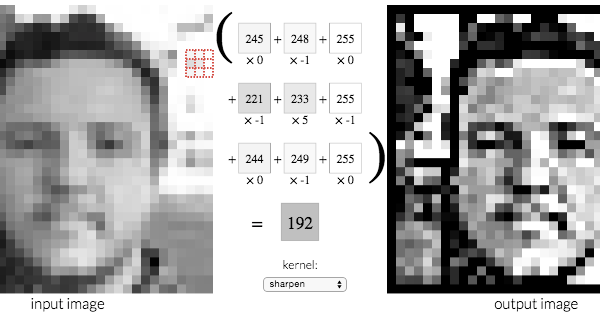

#RAISR
##Rapid and Accurate Image Super Resolution

Super Resolution is a common and historically important problem in computer science.
It is heavy related with data analysis and interpolation.

The idea is to increase the size of an image through deduction using the information still present in the picture.

Algorithms can go from very basic and quick to very complex and slow, and all have the purpose of minimizing the difference between the deduced picture and the "true" picture.

For example, the small picture could be a scaled-down version of the real picture, to save on bandwidth. The small picture could also have simply been taken by a bad camera, and in this situation the "true" picture doesn't exist.

##Basic algorithms

 There are three common interpolation methods for scaling images. They all create a mathematical representation of the space between the pixels, so that any part of the picture can be more-or-less accurately polled from, even if it falls between two pixel values.

 For example, if we scale a picture by a factor of two, we create 4 times the original amount of pixels. All of those need to take a value from the original picture.

 The pixel from the new picture at (400, 400) could just take the value from the old picture at (200, 200), but what about the one at (401, 401) ?

 Nearest-neighbor simply takes the value (200, 200) too. On the other hand, bilinear and bicubic try to guess what the pixel would really be. Bilinear simply takes a weighted average of the 4 closest pixel values, while Bicubic tries to guess the strength of the gradient it is in.

 Recent browsers usually use either bilinear or bicubic. While there is a performance difference, it is negligible.

##Convolution Matrices

Before we can continue, we need to approach the concept of convolution matrices.

A convolution matrix is simply a matrix of factors. It can be "applied" to a pixel by simply taking the values of the pixel and its neighbors, multiplying them by the corresponding factors, and adding it all up.

Applying the matrix to every pixel of an image can give a lot of varying results. If all the values of the matrix are the same, the result would be a very basic blur.

Such matrices can be used to sharpen or blur an image, apply the filters in Instagram, but also to make some patterns (vertical lines) more apparent. This capability is used in convolutional neural networks, to detect patters and then patterns of patterns.

##The RAISR approach

Matrices can effectively increase details, but it's hard to know if we are just increasing noise, or actual features of the image. What made this approach more interesting than a simple sharpen filter is the fact that multiple very different matrices will be used all over the image.

The first step is to cut the image into a lot of small buckets, and to do what is called an Eigenanalysis. It is a quite complicated process, but the important fact is that it gives the angle and the strength of the gradient in the small bucket. A strong gradient is a signal that the current pixel bucket is part of an important part of the image (for example a strand of hair, the horizon, or cables hanging).

 By comparing each bucket with its neighbor, we can get another value called "coherence". If a bucket is not coherent, it might just be a speck, or other feature that are hard to deduce information from.

The team at google then cut hundred of millions of those buckets, calculated their three parameters, and used machine learning to deduce the best convolution matrix for each of the parameters combinations.

Those convolution matrices can then be applied to any picture to create an excellent super resolution algorithm.

The algorithm can then be bettered by using a census transform (to make edges appear) on both the original and final pictures. The difference between the number of edges on both can be used to scale-down the effects of the RAISR algorithms to avoid increasing too much noise on a blurry picture.

##Advantages

The only algorithms that stand up to RAISR are neural-network based, and very slow, especially on browsers. As seen in the benchmark, RAISR is both one of the fastest and one of the best algorithms to this day.

Matrices can be trained on a specific set of images to be optimized for specific purposes, such as removing JPG compression artifacts, as seen in the example pictures.

Louis Garczynski
louis.roc@gmail.com
